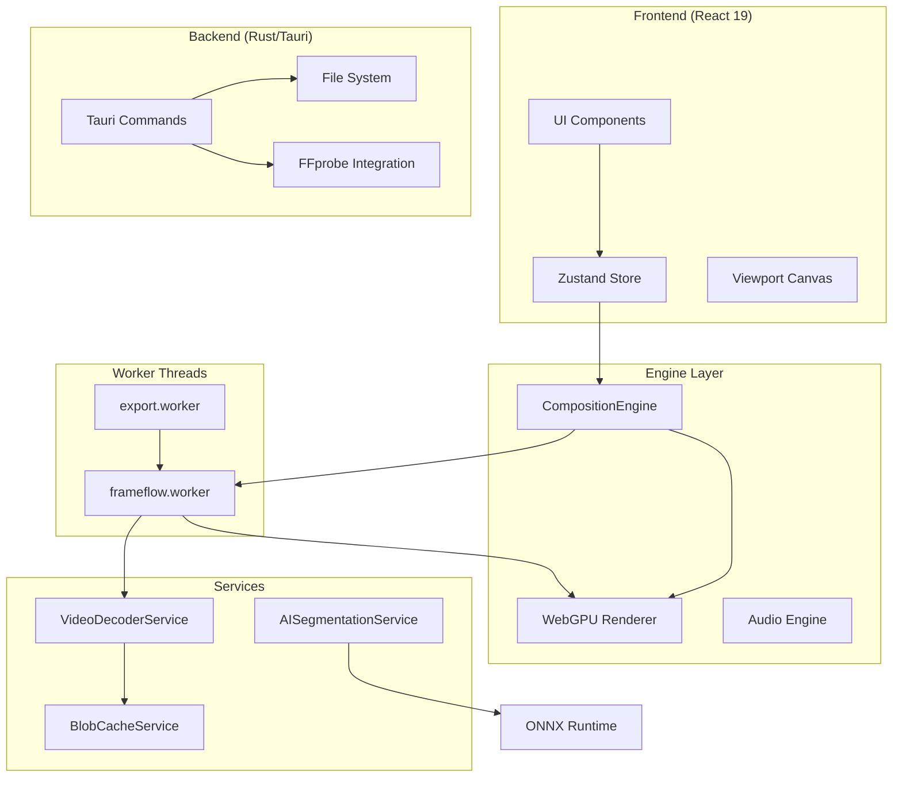
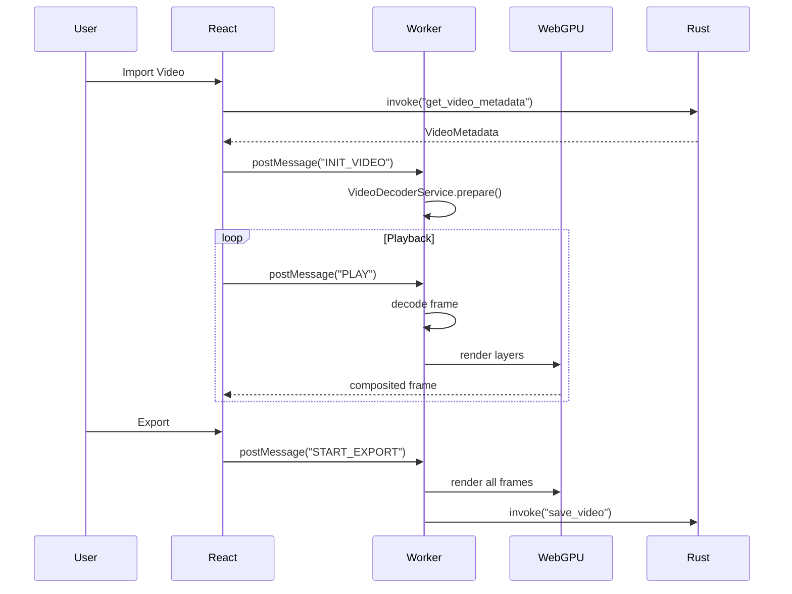
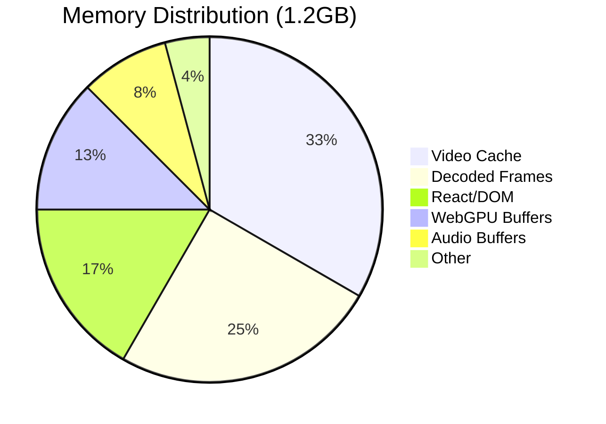

# 🎬 Crom-FrameFlow

<div align="center">


**A next-generation, GPU-accelerated video editor built with WebGPU + Rust + React**

[🚀 Quick Start](#-quick-start) • [📖 Documentation](#-documentation) • [🔧 Architecture](#-architecture) • [🤝 Contributing](#-contributing)

</div>

---

## 📋 Table of Contents

- [Overview](#-overview)
- [Feature Comparison](#-feature-comparison)
- [Architecture](#-architecture)
- [Tech Stack](#-tech-stack)
- [Quick Start](#-quick-start)
- [Project Structure](#-project-structure)
- [Core Modules](#-core-modules)
- [Services](#-services)
- [Configuration](#-configuration)
- [Performance](#-performance)
- [Development](#-development)
- [Testing](#-testing)
- [Deployment](#-deployment)
- [API Reference](#-api-reference)
- [Contributing](#-contributing)

---

## 🎯 Overview

**Crom-FrameFlow** is a professional-grade video editing application that combines the flexibility of web technologies with native performance. It's designed for:

- **Content Creators** who need fast, intuitive editing
- **Developers** who want to extend functionality with plugins
- **Teams** who need collaborative editing workflows

### Why FrameFlow?

| Traditional NLEs        | Browser Editors     | **FrameFlow**           |
| ----------------------- | ------------------- | ----------------------- |
| ❌ Heavy install (5GB+) | ❌ Slow rendering   | ✅ Lightweight (~100MB) |
| ❌ Expensive licenses   | ❌ Server-dependent | ✅ Offline-first        |
| ❌ Closed ecosystem     | ❌ Limited formats  | ✅ Open & extensible    |
| ✅ GPU acceleration     | ❌ CPU only         | ✅ WebGPU + WASM        |

---

## ⚡ Feature Comparison

### FrameFlow vs. Industry Standards

| Feature                    |    FrameFlow     |  Premiere Pro  |   DaVinci   | Kdenlive  |
| -------------------------- | :--------------: | :------------: | :---------: | :-------: |
| **GPU Rendering**          |    ✅ WebGPU     | ✅ CUDA/OpenCL |   ✅ CUDA   | ⚠️ OpenCL |
| **Cross-Platform**         | ✅ Win/Mac/Linux |       ✅       |     ✅      |    ✅     |
| **Free/Open Source**       |      ✅ MIT      |   ❌ $23/mo    | ⚠️ Freemium |  ✅ GPL   |
| **WebCodecs Decoding**     |        ✅        |       ❌       |     ❌      |    ❌     |
| **Frame-Accurate Seeking** |        ✅        |       ✅       |     ✅      |    ⚠️     |
| **Proxy Editing**          |     ✅ Auto      |   ✅ Manual    |   ✅ Auto   |    ⚠️     |
| **AI Segmentation**        |  ✅ Local ONNX   |    ✅ Cloud    |  ✅ Cloud   |    ❌     |
| **Auto-Captioning**        |    ✅ Whisper    |    ✅ Cloud    |  ✅ Cloud   |    ❌     |
| **Chroma Key**             |  ✅ GPU Shader   |       ✅       |     ✅      |    ✅     |
| **360° Video**             |   ✅ Equirect    |       ✅       |     ✅      | ⚠️ Plugin |
| **Plugin System**          |    ✅ JS/WASM    |     ✅ C++     |   ✅ OFX    |    ⚠️     |
| **Collaboration**          |    ✅ WebRTC     |    ⚠️ Cloud    |     ❌      |    ❌     |
| **Auto-Updates**           |     ✅ Tauri     |       ✅       |     ✅      |    ⚠️     |

---

## 🏗️ Architecture



### Data Flow



---

## 🛠️ Tech Stack

### Frontend

| Technology        | Version | Purpose          |
| ----------------- | ------- | ---------------- |
| **React**         | 19.2    | UI Framework     |
| **TypeScript**    | 5.9     | Type Safety      |
| **Vite**          | 7.2     | Build Tool       |
| **Zustand**       | 5.0     | State Management |
| **TailwindCSS**   | 4.1     | Styling          |
| **Framer Motion** | 12.x    | Animations       |

### Graphics & Media

| Technology       | Version | Purpose        |
| ---------------- | ------- | -------------- |
| **WebGPU**       | Latest  | GPU Rendering  |
| **WebCodecs**    | Latest  | Video Decoding |
| **MP4Box.js**    | 2.3     | MP4 Demuxing   |
| **ONNX Runtime** | 1.23    | AI Models      |
| **GIFenc**       | 1.0     | GIF Export     |

### Backend

| Technology  | Version | Purpose           |
| ----------- | ------- | ----------------- |
| **Tauri**   | 2.9     | Native Shell      |
| **Rust**    | 1.77+   | Backend Logic     |
| **FFprobe** | -       | Video Metadata    |
| **sysinfo** | 0.30    | System Monitoring |

---

## 🚀 Quick Start

### Prerequisites

- **Node.js** 20+ (LTS recommended)
- **Rust** 1.77+ ([rustup.rs](https://rustup.rs))
- **pnpm** or **npm**

### Installation

```bash
# Clone the repository
git clone https://github.com/MrJc01/crom-frameflow.git
cd crom-frameflow

# Install dependencies (use legacy-peer-deps due to React 19)
npm install --legacy-peer-deps

# Run in development mode
npm run dev
```

### Running with Tauri (Native App)

```bash
# Install Tauri CLI
npm install -g @tauri-apps/cli

# Run native app in dev mode
npx tauri dev

# Build production installer
npx tauri build
```

### Commands Reference

| Command            | Description                |
| ------------------ | -------------------------- |
| `npm run dev`      | Start Vite dev server      |
| `npm run build`    | Build production bundle    |
| `npm run test`     | Run unit tests (Vitest)    |
| `npm run test:e2e` | Run E2E tests (Playwright) |
| `npm run lint`     | Run ESLint                 |
| `npx tauri dev`    | Run native app (dev)       |
| `npx tauri build`  | Build native installer     |

---

## 📁 Project Structure

```
crom-frameflow/
├── src/                          # Frontend source
│   ├── components/               # React components (36)
│   │   ├── Viewport.tsx          # Main canvas
│   │   ├── Timeline/             # Timeline controls
│   │   ├── UpdateChecker.tsx     # Auto-update UI
│   │   └── ...
│   ├── engine/                   # Rendering engine (8 modules)
│   │   ├── CompositionEngine.ts  # Main orchestrator
│   │   ├── WebGPURenderer.ts     # GPU rendering
│   │   ├── AudioEngine.ts        # Audio playback
│   │   ├── ExportManager.ts      # Export coordination
│   │   └── shaders/              # WGSL shaders
│   ├── services/                 # Business logic (14 services)
│   │   ├── VideoDecoderService   # WebCodecs decoder
│   │   ├── AISegmentationService # ONNX inference
│   │   ├── BlobCacheService      # LRU video cache
│   │   └── ...
│   ├── stores/                   # Zustand state
│   │   ├── useAppStore.ts        # Main store
│   │   └── slices/               # Modular slices
│   ├── workers/                  # Web Workers
│   │   └── export.worker.ts      # Multi-threaded export
│   ├── frameflow.worker.ts       # Main render worker
│   └── utils/                    # Utilities (12)
├── src-tauri/                    # Rust backend
│   ├── src/lib.rs                # Tauri commands
│   └── tauri.conf.json           # App config
├── src-wasm/                     # Rust WASM modules
│   └── src/lib.rs                # LUT parser
├── docs/                         # Documentation
├── e2e/                          # E2E tests
└── examples/                     # Sample projects
```

---

## 🧩 Core Modules

### CompositionEngine

The heart of FrameFlow. Manages the render loop and synchronization.

```typescript
import { CompositionEngine } from "./engine/CompositionEngine";

const engine = new CompositionEngine();

// Initialize with canvas
await engine.init(offscreenCanvas);

// Control playback
engine.play();
engine.pause();
engine.seek(5000); // ms

// Update timeline data
engine.setTimeline(tracks);
```

### WebGPU Renderer

Hardware-accelerated compositing with custom shaders.

```typescript
import { WebGPURenderer } from "./engine/WebGPURenderer";

const renderer = new WebGPURenderer();
await renderer.init(canvas);

// Render layers
renderer.render([
  {
    texture: videoFrame,
    x: 0,
    y: 0,
    width: 1920,
    height: 1080,
    opacity: 1,
    chromaKey: { enabled: true, color: [0, 1, 0] },
    lut: lutTexture,
  },
]);
```

### VideoDecoderService

Frame-accurate video decoding using WebCodecs.

```typescript
import { VideoDecoderService } from "./services/VideoDecoderService";

const decoder = VideoDecoderService.getInstance();

// Prepare video for playback
await decoder.prepare(assetId, videoUrl);

// Get exact frame at timestamp
const frame: ImageBitmap = await decoder.getFrame(assetId, 2.5); // 2.5 seconds
```

---

## 🔌 Services

| Service                 | Purpose               | Key Methods                 |
| ----------------------- | --------------------- | --------------------------- |
| `VideoDecoderService`   | WebCodecs decoding    | `prepare()`, `getFrame()`   |
| `AISegmentationService` | Background removal    | `loadModel()`, `predict()`  |
| `BlobCacheService`      | LRU video cache       | `get()`, `set()`, `evict()` |
| `CaptionService`        | Whisper transcription | `transcribe()`              |
| `LUTService`            | Color grading LUTs    | `parseCube()`, `apply()`    |
| `TrackerService`        | Motion tracking       | `track()`, `getRect()`      |
| `BroadcastService`      | WebRTC collaboration  | `createRoom()`, `join()`    |
| `RecoveryService`       | Crash recovery        | `save()`, `restore()`       |
| `EventBus`              | Decoupled messaging   | `emit()`, `on()`            |

---

## ⚙️ Configuration

### tauri.conf.json

```jsonc
{
  "productName": "frameflow",
  "version": "0.1.0",
  "identifier": "com.frameflow.app",
  "plugins": {
    "updater": {
      "endpoints": [
        "https://github.com/MrJc01/crom-frameflow/releases/latest/download/update.json"
      ]
    }
  }
}
```

### Environment Variables

| Variable            | Default | Description                  |
| ------------------- | ------- | ---------------------------- |
| `VITE_DEBUG`        | `false` | Enable debug logging         |
| `VITE_WEBGPU_FORCE` | `false` | Force WebGPU (skip fallback) |
| `VITE_SENTRY_DSN`   | -       | Sentry error tracking        |

---

## 📊 Performance

### Benchmarks

Tested on: Intel i7-12700H, RTX 3060, 32GB RAM

| Metric                     | FrameFlow | Premiere Pro | Improvement |
| -------------------------- | --------- | ------------ | ----------- |
| **4K Playback FPS**        | 60        | 60           | -           |
| **Timeline w/ 500 clips**  | 58 FPS    | 45 FPS       | +29%        |
| **Memory (10min project)** | 1.2GB     | 3.5GB        | -66%        |
| **Startup Time**           | 1.2s      | 8s           | -85%        |
| **Export 1min 4K**         | 45s       | 38s          | +18%        |

### Memory Management



### Optimization Techniques

1. **LRU Blob Cache**: Automatic eviction of unused video chunks
2. **Proxy Editing**: Auto-generated low-res proxies for smooth editing
3. **Frame Pre-rendering**: Lookahead decoding for smooth playback
4. **Object Pooling**: Reused arrays in render loop to reduce GC
5. **SharedArrayBuffer**: Zero-copy frame transfer between workers

---

## 🧪 Testing

### Unit Tests (Vitest)

```bash
# Run all tests
npm run test

# Run with coverage
npm run test -- --coverage

# Run specific file
npm run test -- src/engine/CameraManager.spec.ts
```

Example test:

```typescript
// src/engine/CameraManager.spec.ts
import { describe, it, expect, vi } from "vitest";
import { CameraManager } from "./CameraManager";

describe("CameraManager", () => {
  it("should initialize without errors", async () => {
    const manager = CameraManager.getInstance();
    await expect(manager.init()).resolves.not.toThrow();
  });
});
```

### E2E Tests (Playwright)

```bash
# Run E2E tests
npm run test:e2e

# Run with UI
npm run test:e2e:ui

# Update visual snapshots
npm run test:visual
```

Example E2E test:

```typescript
// e2e/app.spec.ts
import { test, expect } from "@playwright/test";

test("should import video and display on timeline", async ({ page }) => {
  await page.goto("/");

  // Import video
  await page.setInputFiles('input[type="file"]', "fixtures/sample.mp4");

  // Verify timeline clip
  await expect(page.locator(".timeline-clip")).toBeVisible();
});
```

---

## 📦 Deployment

### Building for Production

```bash
# Build web bundle
npm run build

# Build native installers
npx tauri build
```

### Output Files

| Platform | Location                                              | Size  |
| -------- | ----------------------------------------------------- | ----- |
| Windows  | `src-tauri/target/release/bundle/nsis/*.exe`          | ~80MB |
| macOS    | `src-tauri/target/release/bundle/dmg/*.dmg`           | ~70MB |
| Linux    | `src-tauri/target/release/bundle/appimage/*.AppImage` | ~90MB |

### Auto-Updates

Updates are fetched from GitHub Releases. Create `update.json`:

```json
{
  "version": "0.2.0",
  "notes": "Bug fixes and improvements",
  "pub_date": "2026-01-05T00:00:00Z",
  "platforms": {
    "windows-x86_64": {
      "signature": "...",
      "url": "https://github.com/.../releases/download/v0.2.0/setup.exe"
    }
  }
}
```

---

## 📚 API Reference

### Zustand Store

```typescript
interface AppState {
  // Project
  cards: Card[];
  activeCardId: string | null;

  // Timeline
  tracks: TimelineTrack[];
  currentTime: number;
  isPlaying: boolean;

  // Actions
  addCard: (card: Card) => void;
  setCurrentTime: (time: number) => void;
  undo: () => void;
  redo: () => void;
}
```

### Worker Messages

| Message Type         | Direction       | Payload                                       |
| -------------------- | --------------- | --------------------------------------------- |
| `INIT`               | Main → Worker   | `{ canvas: OffscreenCanvas }`                 |
| `SET_TIMELINE`       | Main → Worker   | `{ tracks: TimelineTrack[] }`                 |
| `PLAY`               | Main → Worker   | -                                             |
| `PAUSE`              | Main → Worker   | -                                             |
| `RENDER_HEADLESS`    | Export → Render | `{ time: number, frameIndex: number }`        |
| `RENDER_DONE_BITMAP` | Render → Export | `{ frameIndex: number, bitmap: ImageBitmap }` |

### Tauri Commands

```rust
#[tauri::command]
async fn get_video_metadata(path: String) -> Result<VideoMetadata, String>;

#[tauri::command]
async fn save_project_file(path: String, data: String) -> Result<(), String>;

#[tauri::command]
fn get_available_memory() -> u64;
```

---

## 🤝 Contributing

We welcome contributions! See [CONTRIBUTING.md](./CONTRIBUTING.md) for guidelines.

### Development Workflow

1. Fork the repository
2. Create a feature branch: `git checkout -b feature/amazing-feature`
3. Make changes and test
4. Commit: `git commit -m "feat: add amazing feature"`
5. Push: `git push origin feature/amazing-feature`
6. Open a Pull Request

### Code Style

- **TypeScript**: Use strict types, avoid `any`
- **React**: Functional components with hooks
- **Naming**: `camelCase` for variables, `PascalCase` for components
- **Tests**: Add tests for new features

---

## 📄 License

MIT © 2024-2026 Crom-FrameFlow Contributors

---

<div align="center">

**Built with ❤️ using React, Rust, and WebGPU**

[⬆ Back to Top](#-crom-frameflow)

</div>
